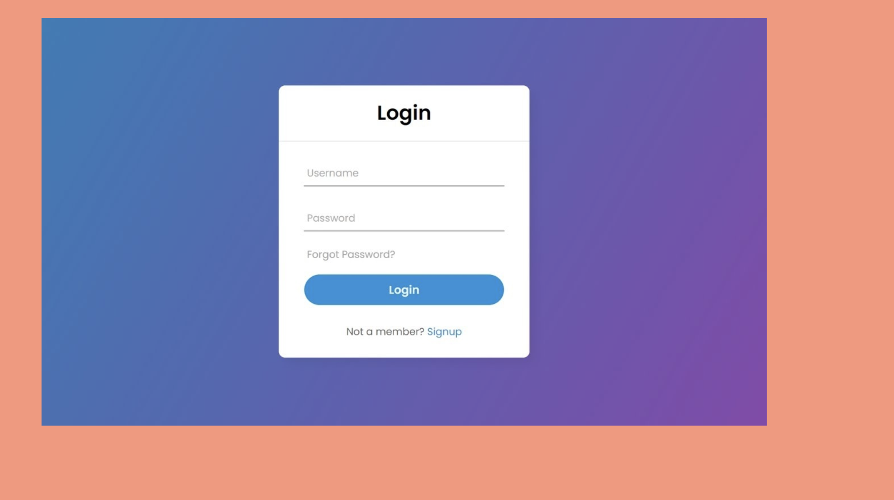
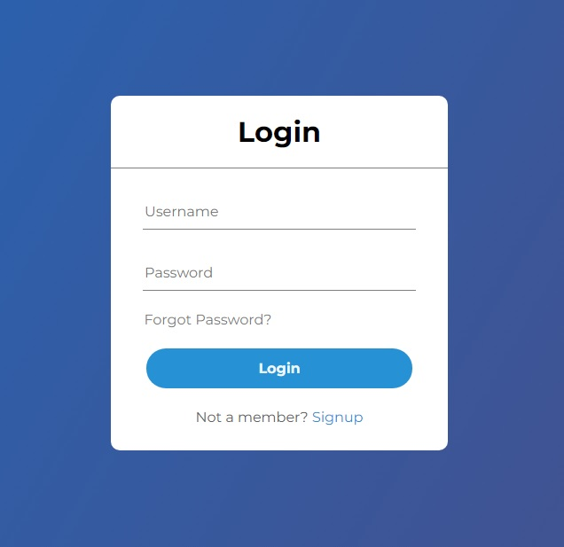

## Assignment-1 (Login Screen)
For the first assigment, you need to prepare a login screen which is centered on the screen.

### Evaluation Criterion
- You need to use class, id or attribute selector. Do not use inline styles.
- You need to use flexbox.
- You need to center login card both vertically and horizontally.
- All elements inside the login card should be centered.
- For bonus points, you need to give pay extra attention to the colors, border radius fonts.

## Solution
### [Codesandbox link to Login Screen Solution](https://codesandbox.io/s/login-j5487)

